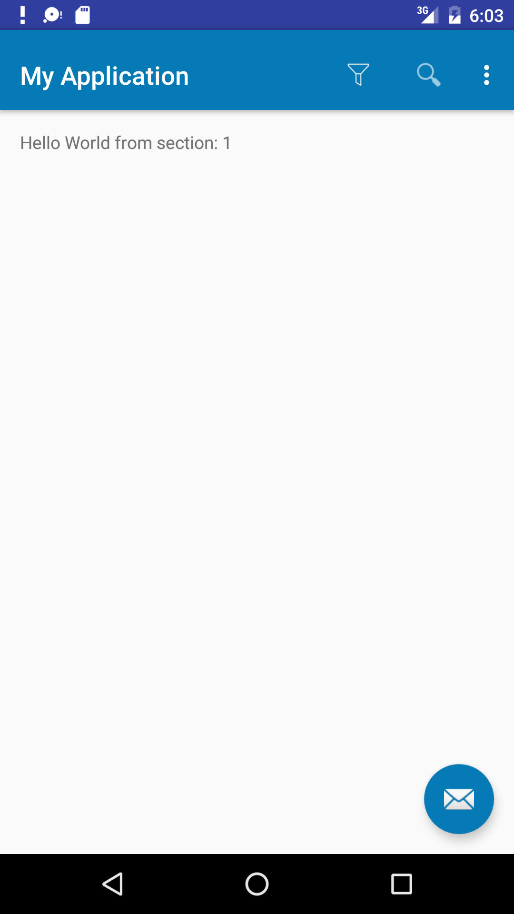
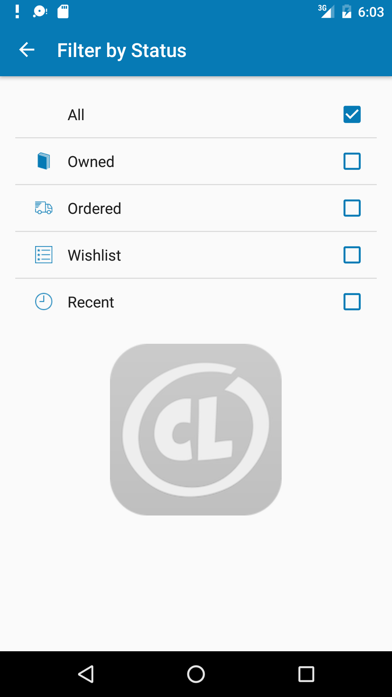

# Android-Filter-Activity-with-Bitmaps

Code shows how to select a single choice from a list and return that choice.  The custom single-choice listview displays a bitmap, the choice string, and a checkmark if selected.

